# DECENTRALIZED AUTO INSURANCE CLAIM dAPP: Automated Claim Processing via Smart Contracts and AI
> Project conducted: 2025-2026 | Graduation Thesis in Data Science and Business Analytics

---

## Introduction

This project was developed as a **Graduation Thesis at the University of Economics – University of Danang (DUE)**. 

**Project Objective:**  
To build an AI-powered, decentralized platform (dApp) on the Ethereum network that automates auto insurance claims. By integrating Smart Contracts, decentralized file storage (IPFS), and AI document parsing, the system aims to resolve inefficiencies, eliminate manual paperwork delays, and prevent insurance fraud through absolute transparency.

**Note:**  
Currently, only the thesis documentation and UI/UX visual assets are uploaded in this repository to demonstrate the system architecture and workflow. The core source code is **not publicly available** at this stage for intellectual property protection.

---

## System Architecture & Workflow

The platform is built on a robust hybrid architecture, seamlessly bridging Web2 components with Web3 decentralized networks.

  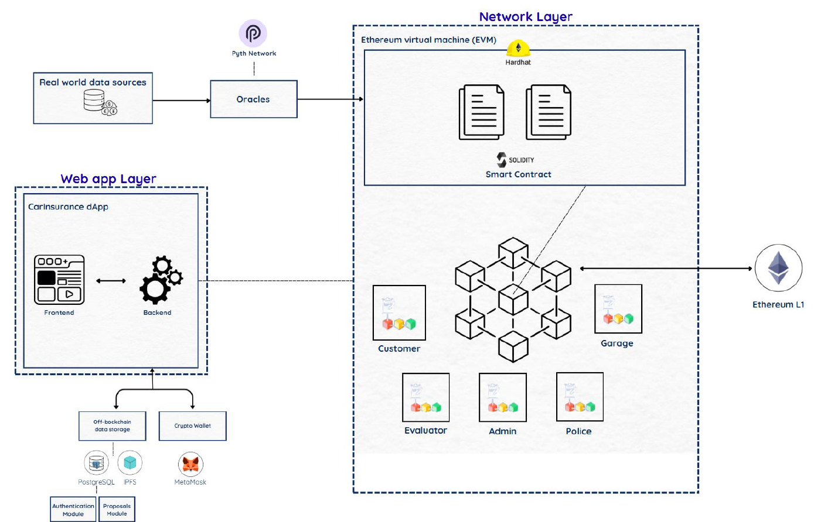 
  <em>System Architecture Diagram: Interaction between Web App Layer, Network Layer, Oracles, and Storage</em>

### End-to-End Sequence Workflow
The diagram below illustrates the end-to-end execution flow, from the moment a user submits a claim with evidence to the final automated payout via smart contracts.

  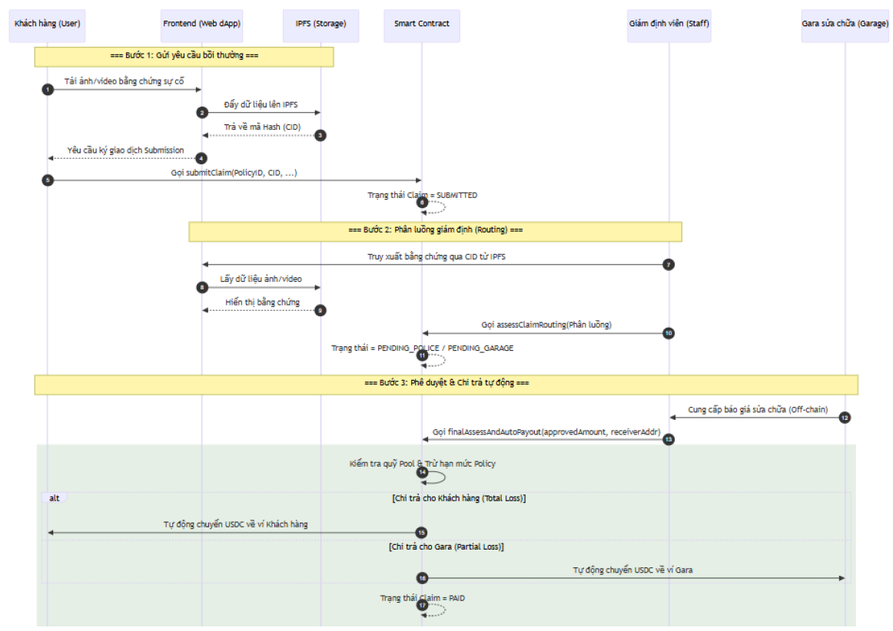 
  <em>Sequence Diagram: End-to-end workflow from claim submission to automated payout execution</em>

---

## Platform Functions Overview

The platform includes **four main features**:

### 1. Overview Dashboard

Provides an interactive and modern Web3 interface tailored for different roles (Customer, Evaluator, Police, Garage, Admin) to:
- Monitor active insurance policies, claim statuses, and transaction histories in real-time.
- View financial analytics, total payouts, and system performance metrics.
- Navigate seamlessly through a role-based access control (RBAC) environment securely connected via MetaMask.

Example:

  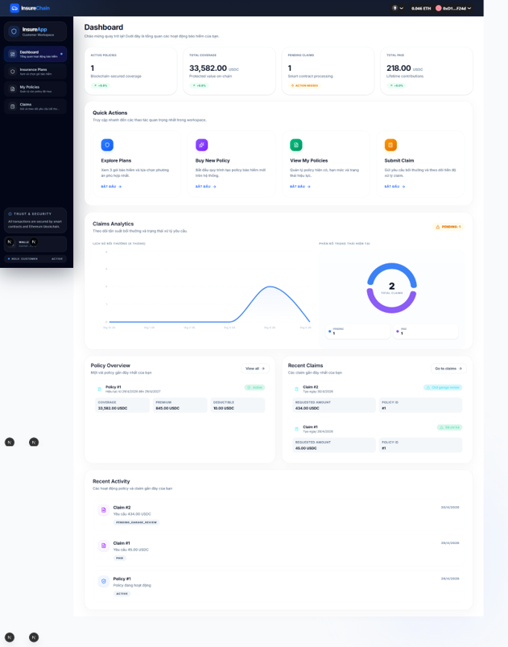 
  <em>Main dashboard overview displaying policy analytics and claim operations</em>

  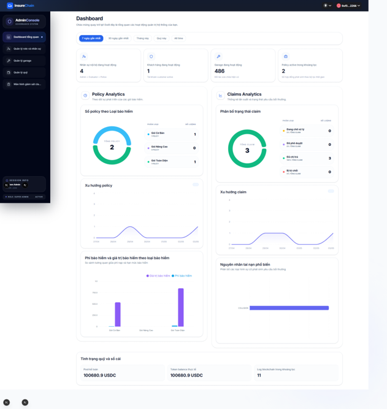 
  <em>Admin governance console for tracking fund status and platform analytics</em>

### 2. Claim Submission & Immutable Storage (IPFS)

A secure portal for customers to declare accidents and submit evidence:
- Users can upload accident photos and mandatory legal documents (e.g., vehicle registration, driver's license).
- Sensitive documents are AES-256-GCM encrypted on the client side before being uploaded to the InterPlanetary File System (IPFS).
- Only the cryptographic hash (CID) is stored on the Ethereum blockchain, ensuring the evidence is tamper-proof while optimizing expensive gas fees.

Example:

  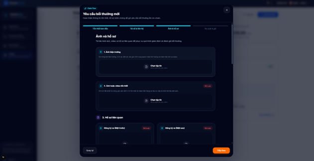 
  <em>Claim submission interface with encrypted document upload</em>

### 3. AI Document Parsing & Automated Assessment

This is the **core highlight** of the off-chain processing capabilities:

- **Functionality:**  
  Automatically extracts and structures tabular data from PDF repair quotes submitted by Garage partners.
- **Technical Implementation:**  
  - Utilizes the **Docling** framework alongside Deep Learning models (**DocLayNet, TableFormer**) and **Tesseract OCR** for intelligent document layout analysis.
  - Transforms unstructured PDFs into structured JSON formats.
  - Eliminates manual data entry for Evaluators, significantly speeding up the final damage assessment and ensuring data accuracy.

Example:

  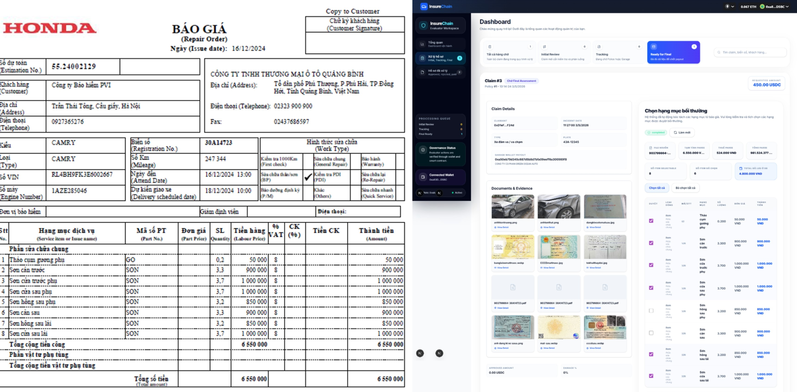 
  <em>Final assessment interface featuring AI-extracted garage repair quotes</em>

  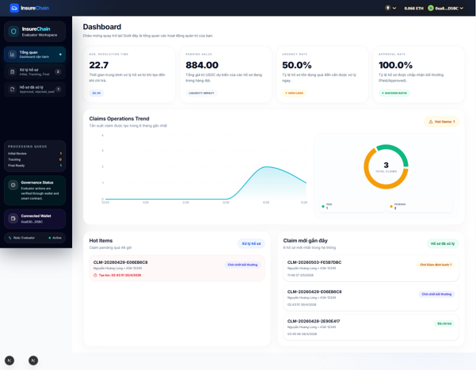 
  <em>Evaluator workspace for managing pending assessments</em>

### 4. Strict Sequential Verification & Auto-Payout

The system enforces a rigorous on-chain workflow governed by Solidity Smart Contracts:

- **Multi-layered Verification:** Claims involving severe damages or human injuries are automatically routed to the Police role. The Evaluator cannot proceed until the Police digitally verify the incident and append a legal evidence hash on-chain.
- **Oracle Integration & Auto-Payout:** Upon final approval, the smart contract utilizes **Pyth Network Oracle** to fetch real-time USD/VND exchange rates. It automatically calculates the indemnity and executes the payout directly to the user's wallet in USDC.
- **Transparency Ledger:** Every status change, verification step, and financial transaction is permanently logged on the Sepolia Testnet, creating an immutable audit trail.

Example:

  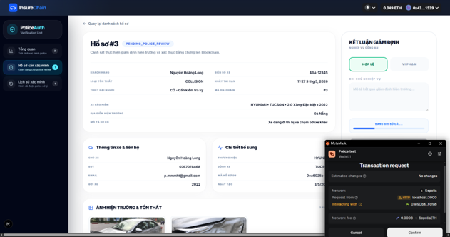 
  <em>Police verification portal for mandatory legal confirmations</em>

  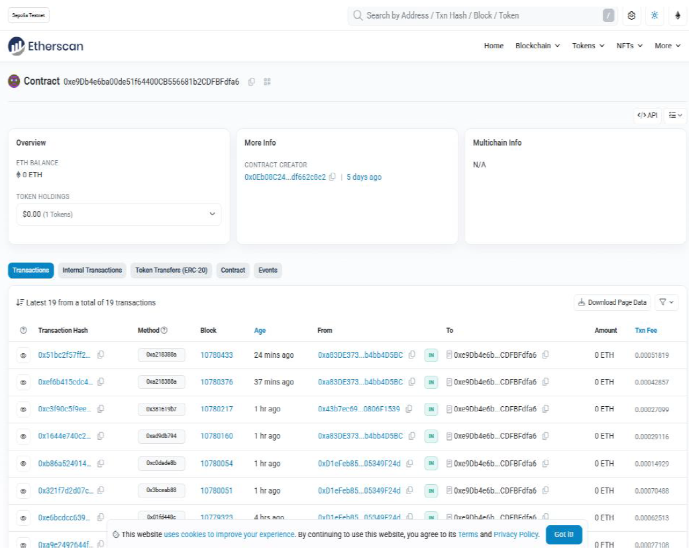 
  <em>On-chain transparency ledger tracking immutable transaction records</em>

---

## UI/UX Design Showcase
The platform features role-based dashboards tailored to the specific needs of Customers, Evaluators, Police, Garage owners, and System Admins. The entire visual language and UI components were prototyped and designed in Figma.

  <strong>Evaluator Workspace</strong> 
   
  <em>Dashboard interface for managing evaluations and claim routing</em>

  <strong>Police Verification Portal</strong> 
  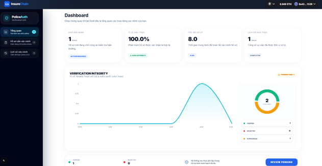 
  <em>Verification portal for reviewing evidence and appending legal hashes</em>

  <strong>Garage Hub</strong> 
  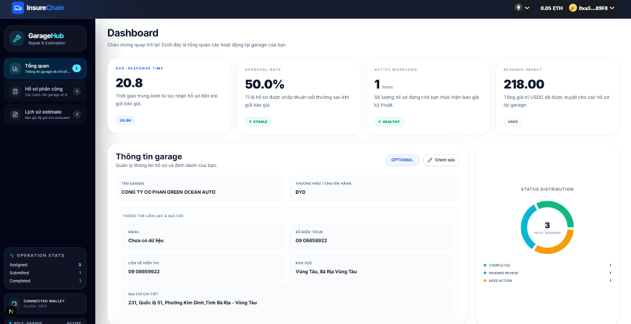 
  <em>Management hub for garage partners to track jobs and submit quotes</em>

  <strong>Admin Governance Console</strong> 
   
  <em>Governance console for tracking fund status, role management, and analytics</em>

---

## How to Use

To explore the system's logic and design:  
**1. View UI Assets:** Browse the `assets/` folder to see all role-based dashboards (Customer, Evaluator, Garage, Police, Admin).  
**2. Read the Documentation:** Review the attached thesis document for an in-depth understanding of the state machine logic, gas optimization strategies, and system architecture.

---

## Learning Outcomes

Through this project, we:
- Developed and deployed secure Smart Contracts on the Ethereum Virtual Machine (EVM) using Solidity.
- Designed a hybrid architecture combining Web2 backends (Next.js, PostgreSQL) with Web3 decentralized storage (IPFS).
- Integrated advanced AI models (DocLayNet, TableFormer) into a real-world financial workflow to automate document processing.
- Translated complex insurance regulations and financial penalty logics into strict, automated algorithmic rules.
- Enhanced UI/UX design skills by building a cohesive, user-friendly Web3 interface in Figma that simplifies blockchain interactions.

---

## Documentation

- **[Project Thesis PDF](./assets/thesis_document.pdf)**

---

## Note on Code Availability

The code for this project is currently **not public** to protect intellectual property and academic integrity. For any collaboration, technical inquiries, or to request access to the source code, please contact the project author.
